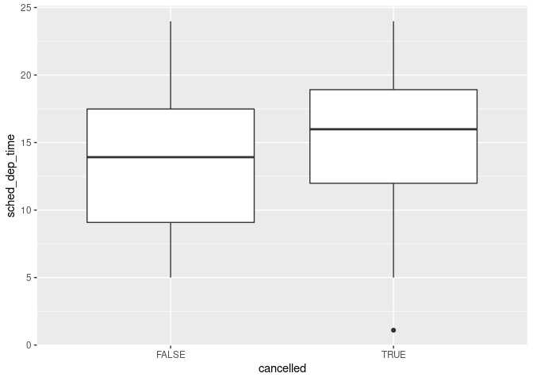
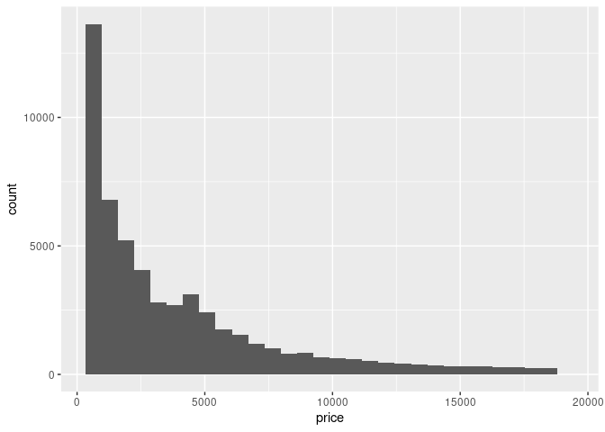

Exploratory Data Analysis
================
Timothy Hanneman

A variable is a quantity, quality, or property that you can measure. A
value is the state of a variable when you measure it. Values change. An
Observation is a set of measurements made under similar conditions.

Tabular data is a set of values, each associated with the variable and
an observation. Tabular data is tidy if each value is placed in its own
“cell”, each variable in its own column, and each observation in its
own row.

Variation is the tendency of the values of a variable to change from
measurement to measurement. Categorical variables can only take one of a
small set of values. (saved as factors, or character vectors) Use a Bar
chart\!

Continuous variables can take any of an infinite set of ordered
    values.

``` r
library(tidyverse)
```

    ## ── Attaching packages ──────────────────────────────────────────────────────────────────────────────────────────────────────── tidyverse 1.2.1 ──

    ## ✔ ggplot2 3.2.1     ✔ purrr   0.3.2
    ## ✔ tibble  2.1.3     ✔ dplyr   0.8.3
    ## ✔ tidyr   1.0.0     ✔ stringr 1.4.0
    ## ✔ readr   1.3.1     ✔ forcats 0.4.0

    ## ── Conflicts ─────────────────────────────────────────────────────────────────────────────────────────────────────────── tidyverse_conflicts() ──
    ## ✖ dplyr::filter() masks stats::filter()
    ## ✖ dplyr::lag()    masks stats::lag()

``` r
ggplot(data = diamonds) +
  geom_bar(mapping = aes(x = cut))
```

<!-- -->

``` r
diamonds %>% count(cut)
```

    ## # A tibble: 5 x 2
    ##   cut           n
    ##   <ord>     <int>
    ## 1 Fair       1610
    ## 2 Good       4906
    ## 3 Very Good 12082
    ## 4 Premium   13791
    ## 5 Ideal     21551

``` r
ggplot(data =diamonds) + geom_histogram(mapping = aes(x = carat), binwidth = 0.5)
```

<!-- -->

``` r
diamonds %>% count(cut_width(carat, 0.5))
```

    ## # A tibble: 11 x 2
    ##    `cut_width(carat, 0.5)`     n
    ##    <fct>                   <int>
    ##  1 [-0.25,0.25]              785
    ##  2 (0.25,0.75]             29498
    ##  3 (0.75,1.25]             15977
    ##  4 (1.25,1.75]              5313
    ##  5 (1.75,2.25]              2002
    ##  6 (2.25,2.75]               322
    ##  7 (2.75,3.25]                32
    ##  8 (3.25,3.75]                 5
    ##  9 (3.75,4.25]                 4
    ## 10 (4.25,4.75]                 1
    ## 11 (4.75,5.25]                 1

``` r
smaller <- diamonds %>% filter(carat < 3)
ggplot(data =smaller, mapping =aes(x = carat))+ geom_histogram(binwidth = 0.1)
```

<!-- -->

``` r
ggplot(data = smaller, mapping = aes(x = carat, colour =cut))+
  geom_freqpoly(binwidth = 0.1)
```

<!-- -->

``` r
ggplot(data = smaller, mapping = aes(x=carat)) +
  geom_histogram(binwidth = 0.01)
```

<!-- -->

``` r
ggplot(data = faithful, mapping = aes(x=eruptions))+ geom_histogram(binwidth = 0.25)
```

<!-- -->

Sometimes you need to change the ‘zoom’ of a graph to see outliers or
under-represented data. coord\_cartesian can zoom into the xlim or ylim.
ggplot2 also has xlim() ylim(), they throw away stuff outside the limits

``` r
ggplot(diamonds)+
  geom_histogram(mapping = aes(x = y), binwidth = 0.5)
```

<!-- -->

``` r
ggplot(diamonds)+
  geom_histogram(mapping = aes(x=y), binwidth = 0.5)+
  coord_cartesian(ylim = c(0,50))
```

<!-- -->

``` r
unusual <- diamonds %>%
  filter(y<3| y>20) %>%
  select(price, x, y, z) %>%
  arrange(y)
unusual
```

    ## # A tibble: 9 x 4
    ##   price     x     y     z
    ##   <int> <dbl> <dbl> <dbl>
    ## 1  5139  0      0    0   
    ## 2  6381  0      0    0   
    ## 3 12800  0      0    0   
    ## 4 15686  0      0    0   
    ## 5 18034  0      0    0   
    ## 6  2130  0      0    0   
    ## 7  2130  0      0    0   
    ## 8  2075  5.15  31.8  5.12
    ## 9 12210  8.09  58.9  8.06

7.3.4 Exercises 1.

``` r
ggplot(data = diamonds)+
  geom_point(mapping = aes(x=x, y=carat), color ="red")+
  geom_point(mapping = aes(x=y, y=carat), color ="blue")+
  geom_point(mapping = aes(x=z, y=carat), color ="black")
```

<!-- -->

``` r
ggplot(data = diamonds)+
  geom_freqpoly(mapping = aes(x=price, color = cut), binwidth=0.1)
```

<!-- -->

``` r
ggplot(data = diamonds)+
  geom_freqpoly(mapping = aes(x=price, color = cut), binwidth=0.5)
```

<!-- -->

``` r
ggplot(data = diamonds)+
  geom_histogram(mapping = aes(x=price, color = cut), binwidth=0.9)
```

<!-- -->

``` r
ggplot(data = diamonds)+
  geom_histogram(mapping = aes(x=price, color = cut), binwidth=1)
```

<!-- -->

``` r
ggplot(data = diamonds)+
  geom_histogram(mapping = aes(x=price, color = cut), binwidth=5)
```

<!-- -->

``` r
ggplot(data = diamonds)+
  geom_histogram(mapping = aes(x=price, color = cut), binwidth=10)
```

<!-- -->

``` r
ggplot(data = diamonds)+
  geom_histogram(mapping = aes(x=price, color = cut), binwidth=100)
```

<!-- -->

``` r
ggplot(data = diamonds)+
  geom_histogram(mapping = aes(x=price, color = cut), binwidth=1000)
```

<!-- -->

``` r
ggplot(data = diamonds)+
  geom_histogram(mapping = aes(x=price, color = cut), binwidth=1000)+
  xlim(0,10000)
```

    ## Warning: Removed 5222 rows containing non-finite values (stat_bin).

    ## Warning: Removed 10 rows containing missing values (geom_bar).

<!-- -->

``` r
ggplot(data = diamonds)+
  geom_histogram(mapping = aes(x=price, color = cut), binwidth=1000)+
  coord_cartesian(xlim = c(0,1000))
```

<!-- -->

``` r
ggplot(data = diamonds)+
  geom_histogram(mapping = aes(x=price, color = cut), binwidth=30)+
  coord_cartesian(xlim = c(0,1000))
```

<!-- -->

``` r
ggplot(data = diamonds)+
  geom_histogram(mapping = aes(x=price, color = cut), binwidth=500)+
  coord_cartesian(xlim = c(600,1000))
```

<!-- --> Makes uneven
graphs, 23 vs 1558

``` r
diamonds %>% filter(carat == 1 | carat == 0.99) -> edges_carat
edges_carat %>% filter(carat ==1) %>% count()
```

    ## # A tibble: 1 x 1
    ##       n
    ##   <int>
    ## 1  1558

``` r
edges_carat %>% filter(carat == 0.99) %>% count()
```

    ## # A tibble: 1 x 1
    ##       n
    ##   <int>
    ## 1    23

``` r
ggplot(data = edges_carat) +
  geom_histogram(mapping = aes(x=carat), binwidth = .01)
```

<!-- -->

CONT

``` r
#Gets rid of unusual values...not a good method
diamonds2 <- diamonds %>%
  filter(between(y, 3, 20))
#Replace with missing values...better
#I honestly have no clue how this is working
diamonds3 <- diamonds %>%
  mutate(y=ifelse(y < 3 | y > 20, NA, y))
ggplot(data = diamonds3, mapping = aes(x=x, y=y))+
  geom_point()
```

    ## Warning: Removed 9 rows containing missing values (geom_point).

<!-- --> ifelse() can
be used to replace values with NA

``` r
nycflights13::flights %>%
  mutate(
    cancelled = is.na(dep_time),
    sched_hour = sched_dep_time %/% 100,
    sched_min = sched_dep_time %% 100,
    sched_dep_time = sched_hour + sched_min /60) %>%
  ggplot(mapping = aes(sched_dep_time))+
    geom_freqpoly(mapping = aes(color = cancelled), binwidth = 1/4)
```

<!-- --> Exercises
7.4.1 1. In a histogram they leave a gap. In a bar graph it ignores NA.
2. na.rm = TRUE prevents sum() from returning NA if there are any NA
values. In Mean()it will by default return NA if there is an NA value.
by setting true it calculates based on the non-NA values.

Covariation is the tendency for variables to variation together in a
related way.

``` r
ggplot(data = diamonds, mapping =aes(x=price))+
  geom_freqpoly(mapping = aes(color =cut), binwidth = 500)
```

<!-- -->

``` r
ggplot(diamonds)+
  geom_bar(mapping = aes(x=cut))
```

<!-- -->

``` r
ggplot(data=diamonds, mapping =aes(x = price, y=..density..))+
  geom_freqpoly(mapping = aes(color = cut), binwidth = 500)
```

<!-- -->

``` r
ggplot(data = diamonds, mapping = aes(x=cut, y =price))+
  geom_boxplot()
```

<!-- -->

``` r
ggplot(data = mpg, mapping = aes(x = class, y = hwy))+
  geom_boxplot()
```

<!-- -->

``` r
ggplot(data = mpg)+
  geom_boxplot(mapping = aes(x=reorder(class, hwy, FUN = median), y=hwy))
```

<!-- -->

``` r
ggplot(data = mpg)+
  geom_boxplot(mapping = aes(x = reorder(class, hwy, FUN = median), y=hwy)) +
  coord_flip()
```

<!-- -->

``` r
flights2 <- 
  nycflights13::flights %>%
  mutate(
    cancelled = is.na(dep_time),
    sched_hour = sched_dep_time %/% 100,
    sched_min = sched_dep_time %% 100,
    sched_dep_time = sched_hour + sched_min / 60
  )

flights2 %>%
  ggplot(aes(x =cancelled, y = sched_dep_time)) +
  geom_boxplot()
```

<!-- -->

2.  
<!-- end list -->

``` r
diamonds %>%
  ggplot(aes(x= cut, y =carat)) +
  geom_boxplot()
```

<!-- -->

``` r
diamonds %>%
  ggplot(aes(x = carat, colour = cut)) +
  geom_density()
```

<!-- -->

The carat of the dimond matters more than the cut, but both look like
they may have some impact.

3.  
<!-- end list -->

``` r
library(ggstance)
```

    ## 
    ## Attaching package: 'ggstance'

    ## The following objects are masked from 'package:ggplot2':
    ## 
    ##     geom_errorbarh, GeomErrorbarh

``` r
diamonds %>%
  ggplot(aes(x=cut, y=carat)) + geom_boxplot() +
  coord_flip()
```

<!-- -->

``` r
diamonds %>%
  ggplot(aes(x=carat, y=cut)) + geom_boxploth()
```

<!-- -->

They look the same.

``` r
library(lvplot)
graphing <- ggplot(diamonds, aes(x=cut, y=price))
graphing + geom_lv()
```

<!-- -->

``` r
graphing <- ggplot(diamonds, aes(x=cut, y=carat))
graphing + geom_lv()
```

<!-- -->

Not quite sure what to make of this plot…

5.  
<!-- end list -->

``` r
diamonds %>%
  ggplot(aes(cut, price)) +
  geom_violin()
```

<!-- -->

``` r
diamonds %>%
  ggplot(aes(price)) +
  geom_histogram()
```

    ## `stat_bin()` using `bins = 30`. Pick better value with `binwidth`.

<!-- -->

Violin plots shows an interesting distribution of the data. Reminds me
of vases.

``` r
diamonds %>%
  count(color,cut)%>%
  ggplot(mapping = aes(x=color, y =cut))+
  geom_tile(mapping = aes(fill = n))
```

<!-- -->

``` r
ggplot(data = diamonds)+
  geom_point(mapping = aes(x=carat, y=price), alpha = 1 /100)
```

<!-- -->

``` r
ggplot(data = smaller)+
  geom_bin2d(mapping = aes(x = carat, y=price))
```

<!-- -->

``` r
ggplot(data = smaller)+
  geom_hex(mapping = aes(x=carat, y=price))
```

<!-- -->

``` r
ggplot(data = smaller, mapping =aes(x= carat, y=price))+
  geom_boxplot(mapping = aes(group = cut_width(carat, 0.1)))
```

<!-- -->

7.5.3.1

1.  
<!-- end list -->

``` r
diamonds %>%
  count(color, cut) %>%
  group_by(color) %>%
  mutate(perc = n / sum(n)) %>%
  ggplot(aes(color, cut, fill = perc)) +
  geom_tile()
```

<!-- --> 5. The plot
shows the linear relationship easily with the scatter plot in that case.
